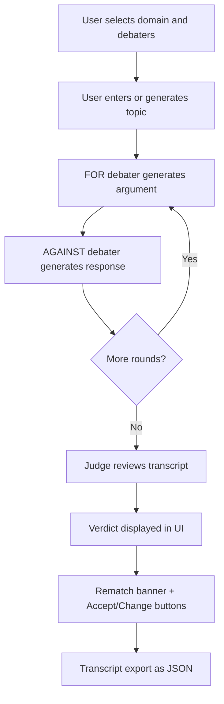
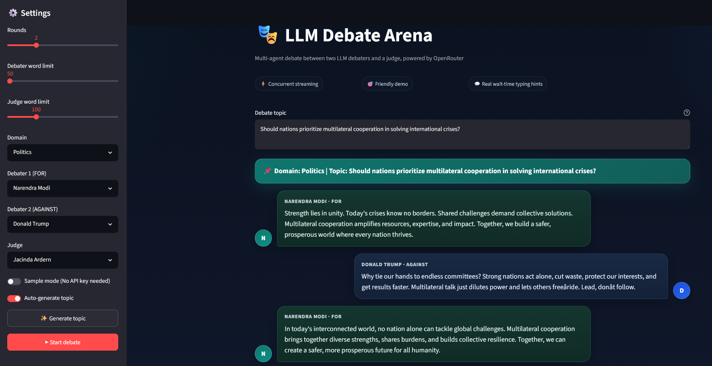
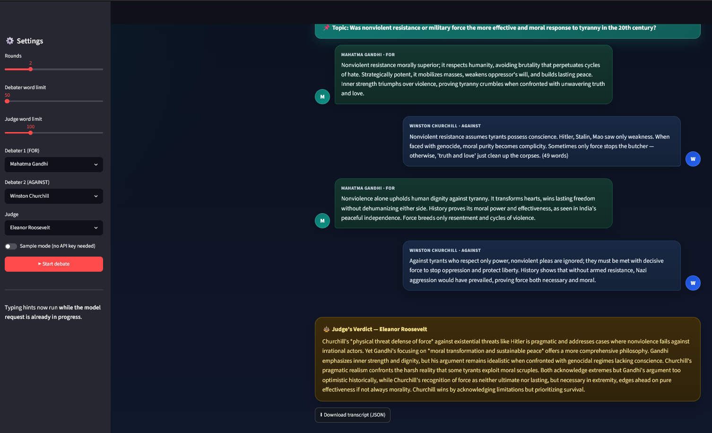

# Multi-Agent Debate Engine

A Streamlit-based multi-agent LLM application where two AI debaters argue opposing sides of a user-defined topic and a judge delivers the final verdict. The app is deployed on Streamlit Community Cloud, uses GitHub as the source of truth for deployment, and demonstrates agent orchestration, streaming UX, prompt design, and production-style Python app structure.

## Live Demo

**App URL:** [https://multi-agent-debate-engine.streamlit.app/](https://multi-agent-debate-engine.streamlit.app/)

## Overview

This project simulates a structured debate between two LLM-powered agents:
- **Debater 1 (FOR)** argues in favor of the topic.
- **Debater 2 (AGAINST)** argues against the topic.
- **Judge** reviews the transcript and produces a final verdict.

The application is designed to feel like a polished chat product rather than a raw model wrapper. It includes side-aware chat bubbles, persona labels, domain-scoped historical personas, AI-assisted topic generation, full-topic visibility, transcript export, sample mode, concurrent typing hints that run while the real model request is already in progress, a post-verdict rematch flow, and a unified visual theme across all UI states.

## Why this project matters

This repo is meant to showcase practical AI application engineering, not just API integration. It highlights:

- Multi-agent orchestration with role-specific prompting.
- Real-time UX considerations for LLM applications.
- Streaming response handling with concurrent UI updates.
- Prompt constraints and persona profiles to keep generated output structured, domain-scoped, and consistent.
- Deployable GitHub-to-Streamlit delivery for a public portfolio project.

## Features

- **Unified Configuration Card**: All settings (Rounds, word limits), domain and persona selectors, topic fields, and action buttons are consolidated into a single glassmorphic card on the main page, removing the sidebar entirely.
- Domain picker with grouped personas across Philosophy, Politics, Economics, Technology, and Science.
- Persona profiles that shape each debater's expertise and rhetorical style within the selected domain.
- Debate topic input with large, always-visible topic area, plus auto-generation and a manual **Generate topic** control.
- Two debaters shown in a chat-style layout, one left-aligned and one right-aligned.
- Clear speaker labels with persona name and side (`FOR` / `AGAINST`).
- Judge response and final verdict after all debate rounds.
- Concurrent typing hints while the model request is already running.
- Adjustable rounds and word limits.
- Word limit sliders in increments of 25.
- Per-role OpenRouter model pickers (**Agent For**, **Agent Against**, **Agent Judge**) populated from the live free-tier text model list.
- `.env` model values remain the preset defaults for each role.
- Downloadable JSON transcript with domain metadata.
- Sample mode for running the app without API credentials; model dropdowns still update chat model chips while debate content remains simulated.
- Post-verdict rematch banner identifying the losing debater.
- **Accept the Rematch** and **Change the Arena** buttons rendered immediately after the verdict.
- Unified color theme across all UI states (typing, rendered, verdict, banner, buttons).
- Ready for deployment on Streamlit Community Cloud.

## Architecture



## Application flow

1. User selects a domain and three distinct personas (FOR debater, AGAINST debater, judge).
2. User selects an OpenRouter free text model for each role (defaults come from `.env`).
3. User enters a debate topic or generates one tailored to the domain and selected debaters.
4. The FOR debater produces the opening argument.
5. The AGAINST debater responds to the topic and prior argument.
6. The exchange repeats for the configured number of rounds.
7. The judge reviews the full transcript.
8. The verdict is rendered in the UI.
9. A rematch banner immediately follows the verdict, naming the losing debater.
10. The user may accept a rematch on a new topic or reset to choose a new arena.
11. The user can download the transcript as JSON (including domain metadata and selected models).

## Concurrency model

One of the key improvements in this version is the move from fake pre-request delays to a true concurrent streaming model.

### Earlier approach
The UI showed staged typing hints first and only then started the LLM call. That made the wait feel longer than necessary.

### Current approach
The app now:
- starts the LLM request immediately,
- streams tokens in a background worker thread,
- rotates hint messages while waiting for the first tokens,
- replaces the hint bubble with the real streamed response as soon as tokens arrive.

This provides a more natural chat experience and avoids unnecessary pre-call waiting.

## Visual theme

All UI elements share a single consistent color palette:

| Element | Color family |
|---------|-------------|
| FOR debater bubble | Teal |
| AGAINST debater bubble | Blue |
| Judge / verdict bubble | Gold |
| Rematch banner | Gold |
| Accept the Rematch button | Gold (primary) |
| Change the Arena button | Slate (neutral) |
| Typing state | Same family, reduced opacity |

CSS variables (`--for`, `--against`, `--judge`) drive all states. Typing no longer uses a separate unrelated color; it uses the same family with lowered opacity and italic style.

## Post-verdict rematch flow

After the judge delivers the verdict:

1. The loser is identified by parsing the verdict text immediately as streaming completes and stored in `st.session_state.loser`.
2. A gold rematch banner renders without delay, naming the losing debater.
3. Two buttons follow:
   - **Accept the Rematch** — keeps the same debaters and prompts for a new topic.
   - **Change the Arena** — resets all state so the user can start fresh.
4. Session state keys `debate_complete`, `rematch_mode`, `verdict`, and `loser` persist across reruns so the banner and buttons remain visible after Streamlit rerenders.

## Tech stack

| Layer | Technology |
|------|------------|
| UI | Streamlit |
| Language | Python |
| LLM access | OpenRouter API |
| App structure | Modular Python package |
| Deployment | Streamlit Community Cloud |
| Source control | GitHub |
| Streaming UX | Python threading + queue |
| Output export | JSON transcript download |

## Project structure

```text
.
├── app.py
├── requirements.txt
├── .env.example
├── .gitignore
├── README.md
├── LICENSE
├── assets/
│   ├── debate-ui.png
│   └── judge-verdict.png
├── DEPLOYMENT_CHECKLIST.md
├── debate_arena/
│   ├── __init__.py
│   ├── engine.py
│   ├── models.py
│   └── personas.py
├── demo/
│   └── example_debate.json
└── tests/
    ├── __init__.py
    └── test_engine.py
```

## Key engineering decisions

### 1. Clear role separation
Each debater has a defined side and persona within a selected domain (Philosophy, Politics, Economics, Technology, or Science). The judge is separate from both debaters, which keeps the workflow interpretable and easier to explain in interviews.

### 2. Persona-aware prompting
`personas.py` defines grouped debaters with expertise and style metadata. The engine injects that profile into system prompts so arguments stay domain-appropriate without naming speakers inside the generated text.

### 3. Prompt discipline
The debaters are instructed not to mention their own names inside arguments. Speaker name and side are shown by the UI instead of being generated inside the text. System and user prompts are split so role constraints stay stable across turns.

### 4. Concurrent hint rendering
Typing hints are not fake front-loaded delays anymore. They now run while the API call is already in progress.

### 5. Sample mode
A portfolio app should still be demonstrable without paid credentials. Sample mode allows visitors and recruiters to experience the UI without needing an API key.

### 6. Environment-driven configuration
Secrets and model config are separated from source code to support safe local development and cloud deployment. The three `OPENROUTER_MODEL_*` values act as preset defaults in the UI; users can override them per role from the main-card dropdowns.

### 7. Live free-model discovery
On each session load, the app fetches OpenRouter's free text models once from `https://openrouter.ai/api/v1/models` (`min_price=0`, `max_price=0`, text input/output only) and reuses that list for all three agent dropdowns. If the fetch fails, the UI falls back to the `.env` defaults and shows a warning below the main card until the page is refreshed.

### 8. Loser detection without extra latency
The loser is determined by a lightweight substring check on the verdict text immediately after streaming completes. The result is stored in `st.session_state.loser` before any UI is rendered, so the rematch banner appears without a visible pause between the verdict and the banner.

### 9. Rematch state persistence
Four session state keys (`debate_complete`, `rematch_mode`, `verdict`, `loser`) ensure the post-verdict UI survives Streamlit reruns. They are only cleared when the user explicitly clicks **Change the Arena**.

## Local setup

### 1. Clone the repository

```bash
git clone https://github.com/rajatthai/multi-agent-debate-engine.git
cd multi-agent-debate-engine
```

### 2. Create and activate a virtual environment

**Windows (PowerShell):**
```powershell
python -m venv .venv
.\.venv\Scripts\Activate.ps1
```

**macOS / Linux:**
```bash
python -m venv .venv
source .venv/bin/activate
```

### 3. Install dependencies

```bash
pip install -r requirements.txt
```

### 4. Configure environment variables

Create a `.env` file based on `.env.example`.

Example:

```env
OPENROUTER_API_KEY=your_key_here
OPENROUTER_API_URL=https://openrouter.ai/api/v1/chat/completions
OPENROUTER_MODEL_DEBATER_1=nvidia/nemotron-3-nano-30b-a3b:free
OPENROUTER_MODEL_DEBATER_2=nvidia/nemotron-3-super-120b-a12b:free
OPENROUTER_MODEL_JUDGE=moonshotai/kimi-k2.6:free
```

The three `OPENROUTER_MODEL_*` values are preset defaults for **Agent For**, **Agent Against**, and **Agent Judge** in the main-card selectors. At runtime, the dropdowns are populated from OpenRouter's live free text model list; if a default is no longer available, the first model from that list is selected instead.

### 5. Run the app

```bash
streamlit run app.py
```

## Cloud Deployment (Optional)

This project is deployed on Streamlit Community Cloud.

### Deploy steps

1. Push the repository to GitHub.
2. Go to [https://share.streamlit.io/](https://share.streamlit.io/).
3. Connect GitHub.
4. Click **Create app**.
5. Select your repository and branch.
6. Set the main file path to `app.py`.
7. Add secrets in the app settings.
8. Deploy.

### Required secrets for Streamlit Community Cloud

```toml
OPENROUTER_API_KEY = "your_key_here"
OPENROUTER_API_URL = "https://openrouter.ai/api/v1/chat/completions"
OPENROUTER_MODEL_DEBATER_1 = "nvidia/nemotron-3-nano-30b-a3b:free"
OPENROUTER_MODEL_DEBATER_2 = "nvidia/nemotron-3-super-120b-a12b:free"
OPENROUTER_MODEL_JUDGE = "moonshotai/kimi-k2.6:free"
```

## Example use cases

- Exploring how different personas argue the same topic within a chosen domain.
- Comparing rhetorical styles across Philosophy, Politics, Economics, Technology, and Science.
- Demonstrating multi-agent orchestration patterns in interviews.
- Showcasing a deployable AI product on GitHub and Streamlit Cloud.
- Experimenting with prompt design for opposing viewpoints and evaluation.
- Using transcript export for later analysis or improvement.
- Triggering a rematch between the same debaters on a new topic after the verdict.

## Limitations

- Auto-generated topics require a live API key; sample mode uses a static fallback topic instead. Topic generation uses the selected **Agent For** model.
- Verdict quality depends heavily on model quality and prompting.
- The judge is still another LLM, not a ground-truth evaluator.
- Long debates may increase latency and token costs.
- UI persistence is session-based; transcripts are not stored server-side.
- Loser detection uses a lightweight heuristic and may misidentify the loser on ambiguous verdicts.
- Free model availability depends on OpenRouter; preset `.env` defaults may occasionally be absent from the live list.
- Streamlit layout customization has some limitations compared to full frontend frameworks.

## Future improvements

- Add transcript history and saved sessions.
- Add judge summary per round.
- Add side-by-side model comparisons.
- Add analytics on argument strength and rebuttal quality.
- Add optional moderation or toxicity filters.
- Add evaluation metrics and benchmark topics.
- Improve loser detection with structured verdict output from the judge model.

## Screenshots





## License

This project is licensed under the MIT License. See the [LICENSE](LICENSE) file for details.
