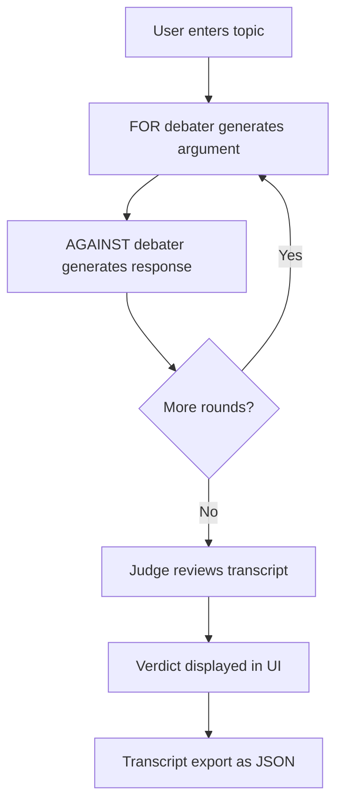

# Multi-Agent Debate Engine

A Streamlit-based multi-agent LLM application where two AI debaters argue opposing sides of a user-defined topic and a judge delivers the final verdict. The app is deployed on Streamlit Community Cloud, uses GitHub as the source of truth for deployment, and demonstrates agent orchestration, streaming UX, prompt design, and production-style Python app structure.

[


## Live Demo

**App URL:** [https://multi-agent-debate-engine.streamlit.app/](https://multi-agent-debate-engine.streamlit.app/)

## Overview

This project simulates a structured debate between two LLM-powered agents:
- **Debater 1 (FOR)** argues in favor of the topic.
- **Debater 2 (AGAINST)** argues against the topic.
- **Judge** reviews the transcript and produces a final verdict.

The application is designed to feel like a polished chat product rather than a raw model wrapper. It includes side-aware chat bubbles, persona labels, full-topic visibility, transcript export, sample mode, and concurrent typing hints that run while the real model request is already in progress.

## Why this project matters

This repo is meant to showcase practical AI application engineering, not just API integration. It highlights:

- Multi-agent orchestration with role-specific prompting.
- Real-time UX considerations for LLM applications.
- Streaming response handling with concurrent UI updates.
- Prompt constraints to keep generated output structured and consistent.
- Deployable GitHub-to-Streamlit delivery for a public portfolio project.

## Features

- Debate topic input with large, always-visible topic area.
- Two debaters shown in a chat-style layout, one left-aligned and one right-aligned.
- Clear speaker labels with persona name and side (`FOR` / `AGAINST`).
- Judge response and final verdict after all debate rounds.
- Concurrent typing hints while the model request is already running.
- Adjustable rounds and word limits.
- Word limit sliders in increments of 25.
- Downloadable JSON transcript.
- Sample mode for running the app without API credentials.
- Ready for deployment on Streamlit Community Cloud.

## Architecture



## Application flow

1. User enters a debate topic.
2. The FOR debater produces the opening argument.
3. The AGAINST debater responds to the topic and prior argument.
4. The exchange repeats for the configured number of rounds.
5. The judge reviews the full transcript.
6. The verdict is rendered in the UI.
7. The user can download the transcript as JSON.

## Concurrency model

One of the key improvements in this version is the move from fake pre-request delays to a true concurrent streaming model.

### Earlier approach
The UI showed staged typing hints first and only then started the LLM call. That made the wait feel longer than necessary.

### Current approach
The app now:
- starts the LLM request immediately,
- streams tokens in a background worker thread,
- rotates hint messages while waiting for the first tokens,
- replaces the hint bubble with the real streamed response as soon as tokens arrive.

This provides a more natural chat experience and avoids unnecessary pre-call waiting.

## Tech stack

| Layer | Technology |
|------|------------|
| UI | Streamlit |
| Language | Python |
| LLM access | OpenRouter API |
| App structure | Modular Python package |
| Deployment | Streamlit Community Cloud |
| Source control | GitHub |
| Streaming UX | Python threading + queue |
| Output export | JSON transcript download |

## Project structure

```text
.
├── app.py
├── requirements.txt
├── .env.example
├── .gitignore
├── README.md
├── LICENSE
├── DEPLOYMENT_CHECKLIST.md
├── debate_arena/
│   ├── __init__.py
│   ├── engine.py
│   └── personas.py
├── demo/
│   └── example_debate.json
└── tests/
    ├── __init__.py
    └── test_engine.py
```

## Key engineering decisions

### 1. Clear role separation
Each debater has a defined side and persona. The judge is separate from both debaters, which keeps the workflow interpretable and easier to explain in interviews.

### 2. Prompt discipline
The debaters are instructed not to mention their own names inside arguments. Speaker name and side are shown by the UI instead of being generated inside the text.

### 3. Concurrent hint rendering
Typing hints are not fake front-loaded delays anymore. They now run while the API call is already in progress.

### 4. Sample mode
A portfolio app should still be demonstrable without paid credentials. Sample mode allows visitors and recruiters to experience the UI without needing an API key.

### 5. Environment-driven configuration
Secrets and model config are separated from source code to support safe local development and cloud deployment.

## Local setup

### 1. Clone the repository

```bash
git clone https://github.com/rajatthai/multi-agent-debate-engine.git
cd multi-agent-debate-engine
```

### 2. Create and activate a virtual environment

**Windows (PowerShell):**
```powershell
python -m venv .venv
.\.venv\Scripts\Activate.ps1
```

**macOS / Linux:**
```bash
python -m venv .venv
source .venv/bin/activate
```

### 3. Install dependencies

```bash
pip install -r requirements.txt
```

### 4. Configure environment variables

Create a `.env` file based on `.env.example`.

Example:

```env
OPENROUTER_API_KEY=your_key_here
OPENROUTER_API_URL=https://openrouter.ai/api/v1/chat/completions
OPENROUTER_MODEL_DEBATER_1=nvidia/nemotron-3-nano-30b-a3b:free
OPENROUTER_MODEL_DEBATER_2=nvidia/nemotron-3-super-120b-a12b:free
OPENROUTER_MODEL_JUDGE=moonshotai/kimi-k2.6:free
```

### 5. Run the app

```bash
streamlit run app.py
```

## Cloud Deployment (Optional)

This project is deployed on Streamlit Community Cloud.

### Deploy steps

1. Push the repository to GitHub.
2. Go to [https://share.streamlit.io/](https://share.streamlit.io/).
3. Connect GitHub.
4. Click **Create app**.
5. Select your repository and branch.
6. Set the main file path to `app.py`.
7. Add secrets in the app settings.
8. Deploy.

### Required secrets for Streamlit Community Cloud

```toml
OPENROUTER_API_KEY = "your_key_here"
OPENROUTER_API_URL = "https://openrouter.ai/api/v1/chat/completions"
OPENROUTER_MODEL_DEBATER_1 = "nvidia/nemotron-3-nano-30b-a3b:free"
OPENROUTER_MODEL_DEBATER_2 = "nvidia/nemotron-3-super-120b-a12b:free"
OPENROUTER_MODEL_JUDGE = "moonshotai/kimi-k2.6:free"
```

## Example use cases

- Exploring how different personas argue the same topic.
- Demonstrating multi-agent orchestration patterns in interviews.
- Showcasing a deployable AI product on GitHub and Streamlit Cloud.
- Experimenting with prompt design for opposing viewpoints and evaluation.
- Using transcript export for later analysis or improvement.

## Limitations

- Verdict quality depends heavily on model quality and prompting.
- The judge is still another LLM, not a ground-truth evaluator.
- Long debates may increase latency and token costs.
- UI persistence is session-based; transcripts are not stored server-side.
- Streamlit layout customization has some limitations compared to full frontend frameworks.

## Future improvements

- Add transcript history and saved sessions.
- Add judge summary per round.
- Add side-by-side model comparisons.
- Add analytics on argument strength and rebuttal quality.
- Add optional moderation or toxicity filters.
- Add evaluation metrics and benchmark topics.

## Screenshots

```md


```
## License

This project is licensed under the MIT License. See the [LICENSE](LICENSE) file for details.
